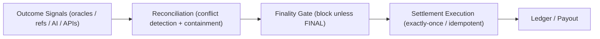

# Deterministic Settlement Gate

A reference implementation of a deterministic settlement and dispute containment control layer
for systems that rely on external outcome resolution (oracles, AI agents, referees, APIs, or humans).

This pattern sits between outcome resolution and payout and prevents money from moving unless
the system can prove the outcome is final and unambiguous.

> ✅ **CI Verified:** GitHub Actions runs `python examples/simulate.py` on every push to validate behavior.

---

## Why this exists

Many real-money systems (prediction markets, exchanges, skill contests, escrow platforms)
suffer from recurring failure modes:

- conflicting oracle or data signals  
- premature settlement on bad or incomplete data  
- double settlement / replay  
- arbitration loops  
- AI agents executing on inference instead of verified outcomes  

Most platforms handle these with ad hoc rules, retries, or manual intervention.

This project demonstrates a formal control-plane architecture that eliminates those failure modes
by enforcing deterministic state transitions, reconciliation, and exactly-once settlement.

---

## High-level flow

Outcome Signals  
→ Reconciliation (conflict detection & containment)  
→ Finality Gate (blocks settlement unless FINAL)  
→ Settlement (exactly-once)

---

## Architecture (Control Plane)



## State machine

OPEN  
→ RESOLVED_PROVISIONAL  
→ IN_RECONCILIATION  
→ FINAL  
→ SETTLED  

Ambiguous or conflicting outcomes are isolated in IN_RECONCILIATION.  
Settlement is impossible unless the case is FINAL.  
Settlement is idempotent (exactly-once).

Reference implementation
The implementation is intentionally small and explicit:

models.py — case, signals, and states

state_machine.py — deterministic transition rules

reconciliation.py — conflict detection and resolution

gate.py — exactly-once settlement gate

store.py — simple in-memory persistence

examples/simulate.py — runnable scenarios

This is not a framework. It is a pattern demonstration.

Finality policy: Once a case reaches FINAL or SETTLED, late or conflicting signals are ignored and cannot reopen settlement. This enforces hard finality and exactly-once execution.

## Running the example

From the project root, execute:

`python examples/simulate.py`

The simulation demonstrates:

- Deterministic resolution and settlement
- Conflict detection and reconciliation
- Settlement blocked until finality is reached
- Idempotent (replay-safe) settlement guarantees

---

## Example trace artifacts (proof without running code)

Running `python examples/simulate.py` writes deterministic trace receipts to:

`examples/traces/`

These are intentionally committed to the repo so reviewers can inspect behavior without executing code.

- Clean settlement: `examples/traces/scenario_clean_case_1.json`
- Conflicting signals (blocked until FINAL): `examples/traces/scenario_conflict_case_2.json`
- Duplicate + late signal (ignored after finality): `examples/traces/scenario_duplicate_and_late_case_3.json`
- 3-oracle / majority resolution: `examples/traces/scenario_three_oracles_majority_case_4.json`

Quick skim (duplicate + late signal case):

```json
{
  "scenario": "scenario_duplicate_and_late",
  "case_id": "case_3",
  "state": "CaseState.SETTLED",
  "final_outcome": "YES",
  "settlement_id": "...",
  "timestamp_utc": "..."
}

---

## Scope & intent

This repository is **not a product** and **not a trading system**.

It exists solely to demonstrate a **settlement integrity control pattern** for systems that
rely on external or probabilistic outcome resolution.

It is intended for discussion and evaluation by engineers working on:

- oracle-resolved markets
- autonomous or AI-driven agents
- human + machine adjudication systems
- regulated or high-liability payout workflows

This code is provided as a **reference implementation**, not a deployable platform.
